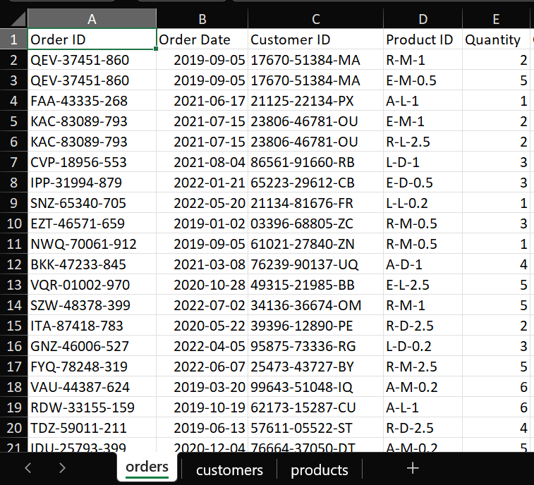
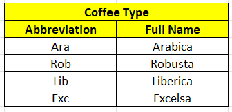
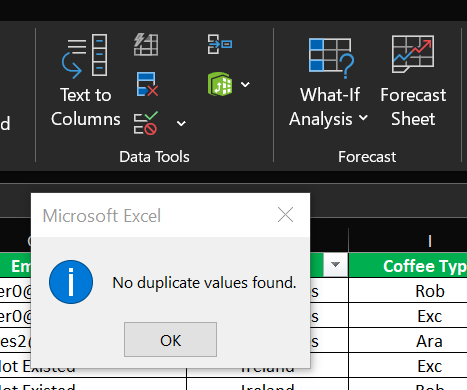

# **Coffee Sales Analysis Using Excel**

# **1. Introduction:**
This data analysis project leverages ***Excel*** as the primary tool for ***formatting and cleaning a comprehensive coffee sales dataset***. The dataset is organized into three main worksheets: ***Orders, Customers, and Products***. The Orders worksheet serves as the ***central fact table***, integrating related customer and product information through the use of ***lookup functions***. This project aims to uncover valuable insights from the coffee sales data, including identifying ***top customers, determining the countries with the most orders, and analyzing which coffee types and roast levels achieve the highest sales***, and finally collect these insights in a **dynamic dashboard***. These insights will provide a robust foundation for future ***data-driven decision-making and strategic planning***.

# **2. Tools I Used:**
To thoroughly explore the coffee sales dataset, I utilized the capabilities of a range of essential tools:

**1. Excel:** for cleaning and formatting the dataset, and then visualizing the insights and creating the dashboard

**2. Git & GitHub:** for sharing my analysis and dashboard.

# **3. Row Data Description:**
The **Raw Data** is consists of three main worksheets **orders, customers and products**, **orders** worksheet would be the main worksheet, it would be like a **fact table**, it would contain the related customers and products information to all orders using **lookup functions**.



In the context of coffee sales analysis, **the Roast Type column with values L, M, and D typically refers to the roast level of the coffee beans**:

- ***L (Light Roast)***
- ***M (Medium Roast)***
- ***D (Dark Roast)***

**Coffee type column**:
- ***Ara (Arabica)***
- ***Rob (Robusta)***
- ***Lib (Liberica)***
- ***EXC (Excelsa)***

**A loyalty card** is a type of card or card-like program that is offered by a business to its customers. With this card, customers can easily **accumulate rewards and unlock exclusive discounts for their purchases**.

# **4. Data Cleaning & Formatting:**
So, to achieve this we will do a group of **steps to make the orders sheet the main (fact) sheet to work with for analysis**:

**(1) Create a "Customer Name" column referenced to the customers sheet using XLOOKUP function:**
```ex
=IF((XLOOKUP($C2,Customers!$A:$A,Customers!$B:$B,,0))=0,"Not Existed",(XLOOKUP($C2,Customers!$A:$A,Customers!$B:$B,,0)))
```

**(2) Create an "Email" column referenced to the customers sheet using XLOOKUP function:**
```ex
=IF((XLOOKUP($C2,Customers!$A:$A,Customers!$C:$C,,0))=0,"Not Existed",(XLOOKUP($C2,Customers!$A:$A,Customers!$C:$C,,0)))
```

**(3) Create an "Country" column referenced to the customers sheet using XLOOKUP function:**
```ex
=IF((XLOOKUP($C2,Customers!$A:$A,Customers!$G:$G,,0))=0,"Not Existed",(XLOOKUP($C2,Customers!$A:$A,Customers!$G:$G,,0)))
```
**(4) Create a "Coffee Type" column referenced to the products sheet using XLOOKUP function:**
```ex
=IF((XLOOKUP($D2,Products!$A:$A,Products!$B:$B,,0))=0,"Not Existed", (XLOOKUP($D2,Products!$A:$A,Products!$B:$B,,0)))
```

**(5) Create a "Roast Type" column referenced to the products sheet using XLOOKUP function:**
```ex
=IF((XLOOKUP($D2,Products!$A:$A,Products!$C:$C,,0))=0,"Not Existed",(XLOOKUP($D2,Products!$A:$A,Products!$C:$C,,0)))
```

**(6) Create a "Size" column referenced to the products sheet using XLOOKUP function:**
```ex
=IF((XLOOKUP($D2,Products!$A:$A,Products!$D:$D,,0))=0,"Not Existed",(XLOOKUP($D2,Products!$A:$A,Products!$D:$D,,0)))
```

**(7) Create a "Unit Price" column referenced to the products sheet using XLOOKUP function:**
```ex
=IF((XLOOKUP($D2,Products!$A:$A,Products!$E:$E,,0))=0,"Not Existed",(XLOOKUP($D2,Products!$A:$A,Products!$E:$E,,0)))
```

**(8) Create a "Total Sales" column using columns ("Quantity", "Unit Price"):**

***-> Total Sales = Unit Price * Quantity***
```ex
=$E2*$L2
```

**(9) Create a "Coffee Type" column to replace short coffee names with full coffee names ("Ara ", "Arabica") - ("Rob", "Robusta") - ("Lib", "Liberica") and ("Exc", "Excelsa"):**

***-> Using Xlookup Function With Referenced Table:***



```ex
=XLOOKUP($I2,$R$5:$R$8,$S$5:$S$8,,0)
```
**(10) Create a "Roast Type" column to replace short roast names with full roast names ("L ", "Light") - ("M", "Medium")  and ("D", "Dark"):**

***-> Using Ifs Function:***
```ex
=IFS($J2="M","Medium",$J2="L","Light",$J2="D","Dark")
```

**(11) Change the date format to column "Order Date" into a more clear and month clearer format using the custom format in number format cells:**
```ex
yyyyy-mm-dd -> dd-mmm-yyyy
2019-09-05 -> 05-Sep-2019
```

**(12) Change the format of the "Size" column to clear the unit of the size "Kg" to make it more clear using the custom format in number format cells:**
```ex
0.5 -> 0.5 Kg
```
**(13) Change the format of the currency columns ("Unit Price", "Total Sales") into dollar sign ($) using accounting number format in numbers:**
```py
9.95 -> $9.95 	 
19.90 -> $19.90 
```

**(14) Select all columns and rows and remove duplicated values if exist, using remove duplicates in data tools in data.**



**(15) Clear repeated columns (Coffee Type - Roast Type)".**

**(16) Create an "Loyalty Card" column referenced to the customers sheet using XLOOKUP function:**
```ex
=IF((XLOOKUP($C2,Customers!$A$2:$A$1001,Customers!$I$2:$I$1001,,0))=0,"Not Existed",(XLOOKUP($C2,Customers!$A$2:$A$1001,Customers!$I$2:$I$1001,,0)))
```
# **5. Dynamic Dashboard:**
I use Excel to create a dynamic dashboard for the coffee sales. The full Excel file that contains the analysis and the dashboard is [here](Excel_File).

<video controls src="Figs/Visualization/Dashboard_Video.mp4" title="Title"></video>

# **6. The Analysis & Insights:**
>The sales data for different coffee types ***(Arabica, Excelsa, Liberica, Robusta)*** show ***fluctuations over time from 2019 to 2022***. There are noticeable peaks and troughs, indicating ***seasonality or external factors affecting sales***.

>***Arabica and Liberica*** show significant peaks at various points, indicating strong sales performance during those periods. ***Robusta and Excelsa*** have more moderate fluctuations.

>***Allis Wilmore leads with the highest sales at $317***, followed by ***Brenn Dundredge at $307***. This indicates strong individual performance or possibly a larger customer base for these sales people.

> ***Light roast is the most preferred***, accounting for ***39%*** of total sales, followed by ***Medium at 32%, and Dark at 29%***. This indicates a market preference for lighter roasts, ***efforts could be directed towards promoting medium and dark roasts to balance the sales distribution***.

> ***Arabica is the most frequently ordered coffee type***, followed closely by ***Excelsa and Liberica***. ***Robusta has the least frequency***. ***Higher inventory levels for Arabica might be necessary to meet demand, while promotions could boost Robusta sales***.

> ***Excelsa leads in total sales revenue***, closely followed by ***Liberica and Arabica***. ***Robusta*** lags behind significantly ***The higher revenue from Excelsa might be due to higher pricing or larger order volumes***. 

> ***United States has a significantly higher order frequency compared to Ireland and the United Kingdom***, indicating a dominant market position. ***Focusing on increasing order frequency in Ireland and the United Kingdom could be a potential growth area***.

# **7. Data Source:**
This data is a study data from Excel project video (The ONLY EXCEL PORTFOLIO PROJECT YOU NEED) from (Mo Chen) YouTube channel: https://www.youtube.com/watch?v=m13o5aqeCbM&t=3s

